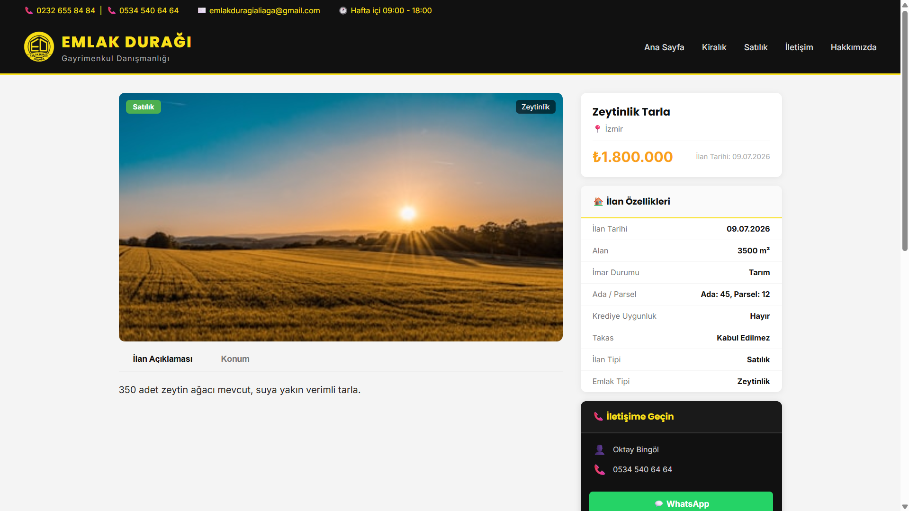
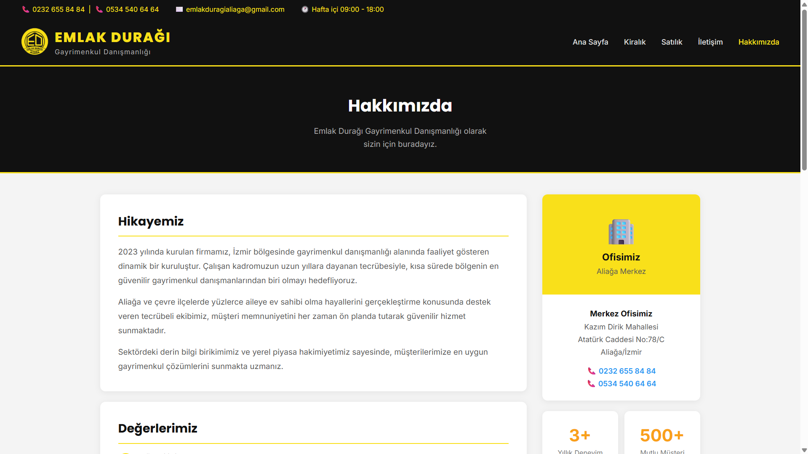
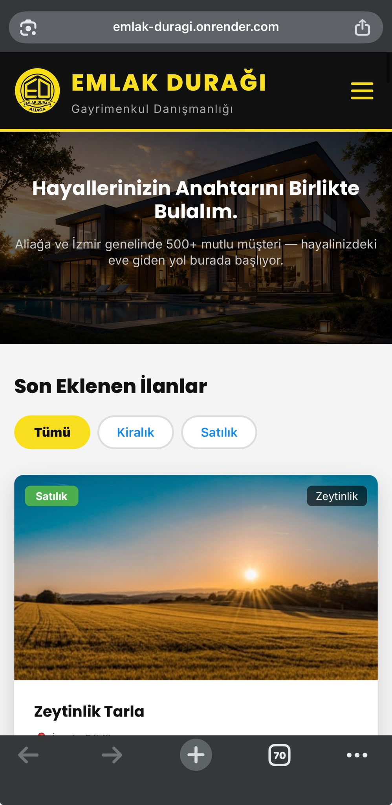

# 🏠 Emlak Durağı – Real Estate Listing Website

A full-stack, production-grade web application built for **Emlak Durağı**, a real estate agency in Aliağa, İzmir. Visitors can browse property listings with filtering and sorting, while authorized admins manage all listings through a secure panel.

🌐 **Live Demo:** [emlak-duragi.onrender.com](https://emlak-duragi.onrender.com)

---

## 📸 Screenshots

| Home Page | Listing Detail |
|---|---|
|  |  |

| About Page | Mobile View |
|---|---|
|  |  |

---

## 🚀 Features

### 👥 Visitor Side

- Browse all active property listings with filtering and sorting (Kiralık / Satılık)
- View detailed information for each listing (photos, price, description, location, land info, WhatsApp contact)
- Fully responsive design — works seamlessly on mobile, tablet, and desktop
- SEO-optimized metadata for better search visibility

### 🔐 Admin Panel

- Secure, token-based admin authentication
- Add, edit, and delete property listings
- Full content control over all site listings

### 🛡️ Security & Compliance

- Rate limiting to prevent abuse
- Helmet.js for HTTP header hardening
- XSS input sanitization/escaping
- KVKK (Turkish data protection law) compliant data handling

---

## 🛠️ Tech Stack

| Layer    | Technology                                           |
| -------- | ----------------------------------------------------- |
| Frontend | HTML, CSS, JavaScript                                 |
| Backend  | Node.js, Express.js                                    |
| Database | PostgreSQL (hosted on Supabase)                        |
| Auth     | Token-based admin authentication                       |
| Security | Helmet, rate limiting, XSS escaping, KVKK compliance    |
| Hosting  | Render (custom domain)                                  |

---

## 📁 Project Structure

```
realestate_website/
├── public/          # Frontend (HTML, CSS, JS)
├── screenshots/      # README preview images
├── server.js         # Express server & API routes
├── database.js       # PostgreSQL (Supabase) connection & queries
├── package.json       # Dependencies
└── .gitignore
```

---

## ⚙️ Getting Started

### Prerequisites

- Node.js installed
- A Supabase (PostgreSQL) project and connection string

### Installation

```bash
git clone https://github.com/pelinbingl/realestate_website.git
cd realestate_website
npm install
```

Create a `.env` file with your database credentials, then:

```bash
node server.js
```

Then open your browser and go to `http://localhost:3000`

---

## 💡 About

This project was built as a real-world property listing platform for a local real estate agency in Aliağa, İzmir. It went from a simple SQLite prototype to a production-hardened application: migrated to PostgreSQL, secured against common web vulnerabilities, and deployed live with a custom domain.

🌐 **Live Demo:** [emlak-duragi.onrender.com](https://emlak-duragi.onrender.com)

---

## 👩‍💻 Developer

**Pelin Bingöl**
[github.com/pelinbingl](https://github.com/pelinbingl) • [linkedin.com/in/pelin-bingöl](https://linkedin.com/in/pelin-bing%C3%B6l)

---

<br>

# 🏠 Emlak Durağı – Emlak İlan Web Sitesi

**Emlak Durağı** adlı, İzmir Aliağa'da faaliyet gösteren emlak ofisi için geliştirilmiş, üretim seviyesinde full-stack bir web uygulaması. Ziyaretçiler filtreleme ve sıralama ile ilanlara göz atabilirken, yetkili adminler tüm ilanları güvenli bir panel üzerinden yönetebilir.

🌐 **Canlı Demo:** [emlak-duragi.onrender.com](https://emlak-duragi.onrender.com)

## 🚀 Özellikler

### 👥 Ziyaretçi Tarafı

- Filtreleme ve sıralama ile tüm aktif ilanları listeleme (Kiralık / Satılık)
- Her ilan için detaylı bilgi (fotoğraf, fiyat, açıklama, konum, arsa bilgileri, WhatsApp iletişim)
- Tamamen responsive tasarım — mobil, tablet ve masaüstünde sorunsuz çalışır
- Arama motoru görünürlüğü için SEO optimizasyonlu metadata

### 🔐 Admin Paneli

- Güvenli, token tabanlı admin kimlik doğrulama
- İlan ekleme, düzenleme, silme
- Sitedeki tüm içerik üzerinde tam kontrol

### 🛡️ Güvenlik & Uyumluluk

- Kötüye kullanımı önlemek için rate limiting
- HTTP header güvenliği için Helmet.js
- XSS girişi temizleme/escaping
- KVKK uyumlu veri işleme

## 🛠️ Kullanılan Teknolojiler

| Katman           | Teknoloji                                             |
| ---------------- | -------------------------------------------------------- |
| Frontend         | HTML, CSS, JavaScript                                     |
| Backend          | Node.js, Express.js                                       |
| Veritabanı       | PostgreSQL (Supabase üzerinde)                             |
| Kimlik Doğrulama | Token tabanlı admin girişi                                 |
| Güvenlik         | Helmet, rate limiting, XSS escaping, KVKK uyumu             |
| Hosting          | Render (özel domain)                                        |

## 💡 Hakkında

Bu proje, İzmir Aliağa'daki bir emlak ofisi için gerçek dünya senaryosuna uygun bir ilan platformu olarak geliştirildi. Basit bir SQLite prototipinden, üretime hazır bir uygulamaya evrildi: PostgreSQL'e taşındı, yaygın web güvenlik açıklarına karşı sertleştirildi ve özel domain ile canlıya alındı.

🌐 **Canlı Demo:** [emlak-duragi.onrender.com](https://emlak-duragi.onrender.com)

## 👩‍💻 Geliştirici

**Pelin Bingöl**
[github.com/pelinbingl](https://github.com/pelinbingl) • [linkedin.com/in/pelin-bingöl](https://linkedin.com/in/pelin-bing%C3%B6l)
